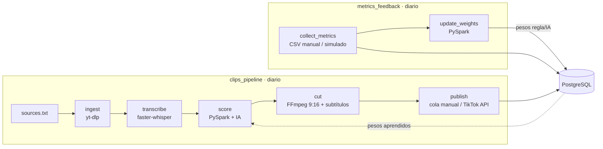

# TikTok Clips Pipeline


Pipeline de datos que convierte videos largos en clips verticales listos para TikTok y aprende
de su rendimiento. Usa **Airflow** (orquestación), **PySpark** (scoring y análisis),
**PostgreSQL** (modelo de datos) y una capa de **IA intercambiable** (Gemini, Claude o ninguna)
para evaluar el potencial viral y generar títulos, hooks y hashtags.

## Arquitectura

Dos DAGs de Airflow:



### clips_pipeline

1. **ingest**: descarga las URLs nuevas (idempotente) y rechaza videos sin pista de audio.
2. **transcribe**: faster-whisper genera la transcripción, agrupada en ventanas candidatas de 20–60 s.
3. **score**: PySpark calcula un puntaje por reglas explicables. Solo el top N pasa a la IA
   (control de costos), que devuelve puntaje, título, hook y hashtags. Puntaje final =
   `w_regla · regla + w_ia · IA` (0.4 / 0.6 al inicio). Cada llamada queda en `llm_calls`.
4. **cut**: FFmpeg recorta a 1080×1920 (escala + recorte central, sirve para cualquier proporción)
   y quema subtítulos SRT generados desde la transcripción.
5. **publish**: según `TIKTOK_MODE` (ver abajo).

### metrics_feedback (bucle de retroalimentación)

1. **collect_metrics**: guarda un snapshot por clip en `clip_metrics`, con su origen
   (`manual` o `simulated`). Es idempotente: no duplica snapshots idénticos.
2. **update_weights**: PySpark correlaciona el puntaje de reglas y el de la IA con la tasa de
   engagement `(likes + 2·shares) / views`. Con suficientes clips con métricas reales
   (`INSIGHTS_MIN_SAMPLES`, 10 por defecto) ajusta los pesos de la mezcla, suavizados y
   acotados entre 0.2 y 0.8, y los guarda en `scoring_weights`. El siguiente `score` los usa.

Las métricas simuladas sirven solo para demostrar el flujo: **no se usan para aprender pesos**
salvo que actives `INSIGHTS_INCLUDE_SIMULATED=true`.

## Inicio rápido

Requisitos: Docker Desktop.

```bash
cp .env.example .env     # en Windows, edita .env con el Bloc de notas
# agrega URLs (contenido propio o con licencia) en config/sources.txt
docker compose up -d --build
```

Airflow: http://localhost:18080 (usuario `admin`, contraseña `admin`). Activa los DAGs
`clips_pipeline` y `metrics_feedback`. Si usas el puerto 8080 en tu máquina, ajusta el mapeo
en `docker-compose.yml`.

Si ya tenías la base de datos creada, aplica las migraciones:

```bash
cat sql/migrations/002_phase2.sql | docker compose exec -T postgres psql -U airflow -d clips
cat sql/migrations/003_phase3.sql | docker compose exec -T postgres psql -U airflow -d clips
```

## Proveedor de IA

Se elige con `LLM_PROVIDER` en `.env`:

| Valor | Comportamiento |
|---|---|
| `none` (por defecto) | Solo reglas de PySpark. Título y hook salen de la primera frase del segmento. |
| `gemini` | Gemini API (`google-genai`). Requiere `GEMINI_API_KEY`; el modelo se cambia con `GEMINI_MODEL`. Respeta los límites del plan gratuito con espera entre llamadas y reintentos ante 429/5xx. |
| `claude` | Claude API. Requiere `ANTHROPIC_API_KEY` y saldo en la cuenta. |

Los nombres de modelos cambian con el tiempo: si la API responde 404, revisa los modelos
disponibles para tu cuenta y ajusta `GEMINI_MODEL`. Revisa también las condiciones de uso de datos
del plan gratuito antes de enviar contenido que no sea tuyo.

## Publicación en TikTok

Se controla con `TIKTOK_MODE`:

| Modo | Qué hace |
|---|---|
| `manual` (por defecto) | No llama a la API. Deja clips y textos en `data/clips/publish_queue.csv`. |
| `draft` | Sube el video al buzón de TikTok del usuario (scope `video.upload`). |
| `direct` | Publica directamente (scope `video.publish`). |

`draft` y `direct` requieren una app registrada en TikTok for Developers, aprobada, y un
`TIKTOK_ACCESS_TOKEN`. Las apps sin auditar suelen publicar solo en privado
(`TIKTOK_PRIVACY=SELF_ONLY`); verifica las restricciones vigentes en la documentación oficial.

## Métricas

TikTok exige una app aprobada para leer métricas, así que hoy la fuente real es manual:
copia los números de TikTok Studio en `data/metrics_input.csv`:

```csv
clip_id,views,likes,shares,avg_watch_time
2,8639,817,50,29
```

`METRICS_SOURCE=manual` (por defecto) lee ese archivo; `METRICS_SOURCE=simulated` genera datos
sintéticos deterministas, marcados como tales en la base de datos.

## Modelo de datos

`videos` → `transcript_lines` → `segments` (puntajes, título, hook, hashtags) → `clips`
(estado de publicación) → `clip_metrics` (snapshots con origen). Además `llm_calls`
(uso de la IA) y `scoring_weights` (historial de pesos aprendidos).

## Calidad

- 40 tests con `pytest` (`pip install -r requirements.txt && pytest`; el test de Spark requiere Java).
- CI en GitHub Actions: tests y escaneo de secretos con gitleaks.
- Los secretos viven solo en `.env`, ignorado por Git. `.env.example` no lleva claves.

## Roadmap

- [x] Fase 1: ingesta, transcripción, scoring, corte vertical
- [x] Fase 2: subtítulos quemados y publicación con la Content Posting API
- [x] Fase 3: capa de IA intercambiable, métricas y bucle de pesos
- [ ] Fase 4: dashboard (Metabase/Streamlit) y calidad de datos (Great Expectations)

## Notas

- Usa solo contenido propio o con licencia que permita remezclarlo.
- Nunca subas tu `.env` al repositorio.
