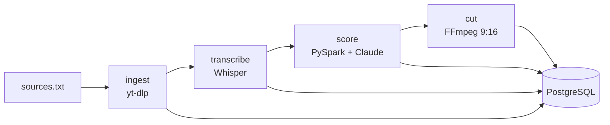

# TikTok Clips Pipeline

Pipeline de datos que convierte videos largos en clips verticales listos para TikTok, usando
**Airflow** (orquestación), **PySpark** (scoring a escala), **PostgreSQL** (modelo de datos) y
**Claude** (evaluación de potencial viral, títulos, hooks y hashtags).

## Arquitectura



1. **ingest**: descarga las URLs nuevas (idempotente).
2. **transcribe**: Whisper genera la transcripción y se agrupa en ventanas candidatas de 20–60 s.
3. **score**: PySpark calcula un puntaje por reglas explicables; Claude evalúa solo el top N
   (control de costos) y devuelve puntaje, título, hook y hashtags. Todas las llamadas quedan
   registradas en `llm_calls`.
4. **cut**: FFmpeg recorta los mejores segmentos a vertical 1080x1920 y quema los subtítulos (SRT generado desde la transcripción).
5. **publish**: sube los clips a TikTok según `TIKTOK_MODE` (ver abajo).

## Inicio rápido

```bash
cp .env.example .env        # agrega tu ANTHROPIC_API_KEY
mkdir -p data && chmod -R 777 data   # solo necesario en Linux
# agrega URLs (contenido propio o con licencia) en config/sources.txt
docker compose up --build
```

Airflow en http://localhost:8080 (usuario `admin`, contraseña `admin`). Activa el DAG `clips_pipeline`.

Tests locales: `pip install -r requirements.txt && pytest` (el test de Spark requiere Java).

## Publicación en TikTok

Se controla con `TIKTOK_MODE` en `.env`:

| Modo | Qué hace |
|---|---|
| `manual` (por defecto) | No llama a la API. Deja los clips y sus textos en `data/clips/publish_queue.csv` para subirlos a mano. |
| `draft` | Sube el video al buzón de TikTok del usuario (scope `video.upload`); el usuario termina la publicación en la app. |
| `direct` | Publica directamente (scope `video.publish`). |

Para `draft` y `direct` necesitas registrar una app en TikTok for Developers, que pase su revisión, y un
`TIKTOK_ACCESS_TOKEN` del usuario autorizado. Según la documentación de TikTok, las apps sin auditar
suelen publicar solo en modo privado (`TIKTOK_PRIVACY=SELF_ONLY`); verifica las restricciones vigentes
en la documentación oficial. Cada clip fallido queda en estado `failed` con el error guardado en `clips.error`.

Si ya tienes la base de datos de la Fase 1 creada, aplica la migración:
`cat sql/migrations/002_phase2.sql | docker compose exec -T postgres psql -U airflow -d clips`

## Roadmap

- [x] Fase 1: ingesta, transcripción, scoring, corte vertical
- [x] Fase 2: subtítulos quemados y publicación con la Content Posting API de TikTok
- [ ] Fase 3: recolección de métricas y feedback loop al scoring
- [ ] Fase 4: dashboard (Metabase/Streamlit), calidad de datos (Great Expectations), CI con GitHub Actions

## Notas

- Usa solo contenido propio o con licencia que permita remezclarlo.
- La API de publicación de TikTok requiere registrar una app y pasar revisión.
- Nunca subas tu `.env` al repositorio (ya está en `.gitignore`).
