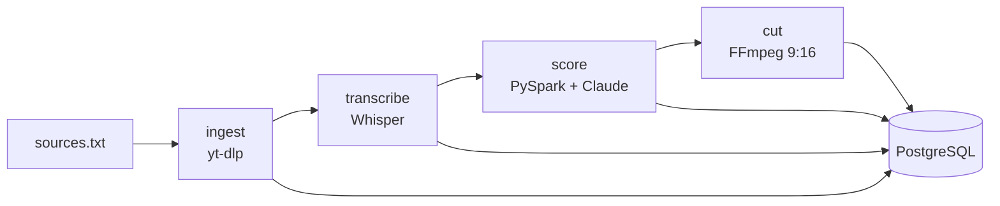

# TikTok Clips Pipeline

Pipeline de datos que convierte videos largos en clips verticales listos para TikTok, usando
**Airflow** (orquestación), **PySpark** (scoring a escala), **PostgreSQL** (modelo de datos) y
**Claude** (evaluación de potencial viral, títulos, hooks y hashtags).

## Arquitectura



1. **ingest**: descarga las URLs nuevas (idempotente).
2. **transcribe**: Whisper genera la transcripción y se agrupa en ventanas candidatas de 20–60 s.
3. **score**: PySpark calcula un puntaje por reglas explicables; Claude evalúa solo el top N
   (control de costos) y devuelve puntaje, título, hook y hashtags. Todas las llamadas quedan
   registradas en `llm_calls`.
4. **cut**: FFmpeg recorta los mejores segmentos a formato vertical 1080x1920.

## Inicio rápido

```bash
cp .env.example .env        # agrega tu ANTHROPIC_API_KEY
mkdir -p data && chmod -R 777 data   # solo necesario en Linux
# agrega URLs (contenido propio o con licencia) en config/sources.txt
docker compose up --build
```

Airflow en http://localhost:8080 (usuario `admin`, contraseña `admin`). Activa el DAG `clips_pipeline`.

Tests locales: `pip install -r requirements.txt && pytest` (el test de Spark requiere Java).

## Roadmap

- [x] Fase 1: ingesta, transcripción, scoring, corte vertical
- [ ] Fase 2: subtítulos quemados, publicación con la Content Posting API de TikTok
- [ ] Fase 3: recolección de métricas y feedback loop al scoring
- [ ] Fase 4: dashboard (Metabase/Streamlit), calidad de datos (Great Expectations), CI con GitHub Actions

## Notas

- Usa solo contenido propio o con licencia que permita remezclarlo.
- La API de publicación de TikTok requiere registrar una app y pasar revisión.
- Nunca subas tu `.env` al repositorio (ya está en `.gitignore`).
